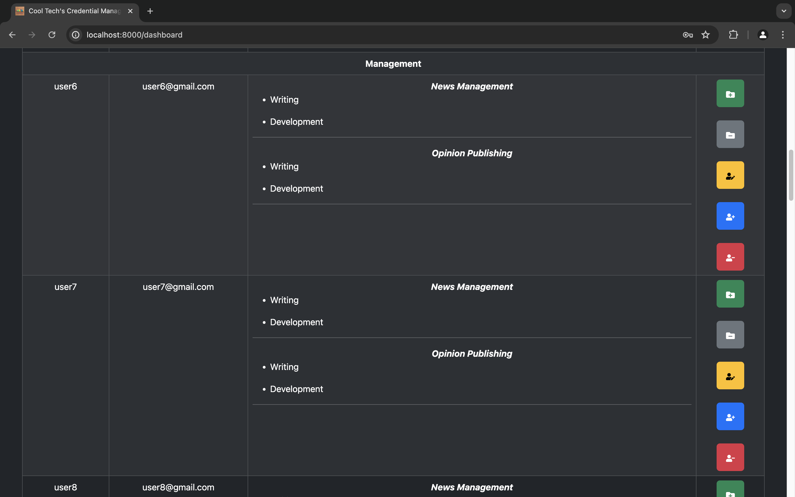
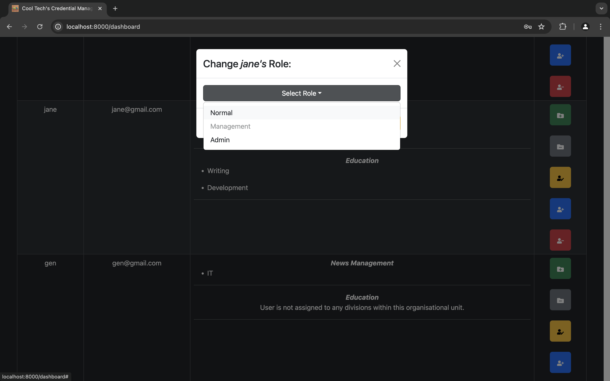

# Credential Management System Full Stack Web Application

Welcome to the Credential Management System for Cool Tech! This application is designed to securely and efficiently manage credentials across various organisational units and divisions for several systems and platforms. Built using the MERN stack (MongoDB, Express.js, React.js, Node.js), it features robust authentication and role-based access control.

## Table of Contents

- [Project Overview](#project-overview)
- [Features](#features)
- [Technologies Used](#technologies-used)
- [Setup Instructions](#setup-instructions)
- [Usage](#usage)
- [API Endpoints](#api-endpoints)
- [Frontend Components](#frontend-components)
- [Testing](#testing)
- [Contributing](#contributing)
- [Screenshots](#screenshots)
- [Notes](#notes)
- [Credits](#credits)

## Project Overview

Cool Tech has grown substantially and now requires a sophisticated internal tool to manage credentials for various systems. This web app facilitates:

- Secure login and registration.
- Role-based access control.
- Management of organisational units and divisions.
- CRUD operations for credential repositories.

## Features

- **User Authentication**: Secure login and registration with JWT-based authentication.
- **Role-Based Access Control**: Different permissions for users with different roles, namely: normal, management and admin.
- **Organisational Units & Divisions**: View and manage credentials across multiple organisational units and divisions.
- **Credential Management**: View, add, update and manage credentials within divisions with role-based permissions.
- **User Management**: Assign and unassign users to/from divisions and OUs and change user roles (assign roles and manage user access).
- **Waterfall Development Process**: Each feature is developed in its entirety (frontend and backend) before moving on to the next.

## Technologies Used

- **Backend**:
  - **Express.js**: Web framework for Node.js.
  - **MongoDB**: NoSQL database for storing data.
  - **Mongoose**: ODM for MongoDB.
  - **JWT**: JSON Web Tokens for authentication.
- **Frontend**:
  - **React**: Library for building user interfaces.
  - **Vite**: Build tool and development server.
  - **React Bootstrap**: UI components and styling.

## Setup Instructions

### Prerequisites

- [Node.js](https://nodejs.org/) (v14.x or higher)
- [MongoDB](https://www.mongodb.com/)
- [Postman](https://www.postman.com/)

### Installation

1. **Clone the repository**:

```sh
git clone https://github.com/jediahjireh/credential-management.git
```

2. **Navigate to the project directory**:

```sh
cd credential-management
```

3. **Setup Backend**:

```sh
cd backend
npm install
```

- Create a `.env` file in the `backend` directory with the following variables:

```env
MONGO_URI=mongodb-connection-string
SECRET_KEY=secret-key
PORT=8080
```

4. **Setup Frontend**:

```sh
cd ../frontend
npm install
```

## Usage

1. **Start the Backend Server**:

```sh
cd backend
npm start
```

The backend server will be available at `http://localhost:8080`.

2. **Start the Frontend Development Server**:

```sh
cd ../frontend
npm run dev
```

The frontend development server will run on `http://localhost:8000`.

**NB**
Uncomment `line 26` of [server.js](/backend/server.js) to populate database if necessary.


## API Endpoints

### User Endpoints

- **Login**: `POST /api/user/login`
- **Register**: `POST /api/user/register`
- **Get Users**: `GET /api/user/users`
- **Change User Role**: `PUT /api/user/change-role`

### Organisational Unit Endpoints

- **Get Organisational Units**: `GET /api/ou/organisational-units`
- **Assign User to OU**: `PUT /api/ou/assign-ou`
- **Unassign User from OU**: `PUT /api/ou/unassign-ou`
- **Add Credential**: `POST /api/ou/add-credential`
- **Update Credentials**: `PUT /api/ou/update-credentials`
- **Assign User to Division**: `PUT /api/ou/assign-division`
- **Unassign User from Division**: `PUT /api/ou/unassign-division`

## Frontend Components

- **User Management**: Components for login, registration, and user management.
- **Organisational Units**: Components for viewing and managing organisational units and divisions.
- **Credential Management**: Components for adding, updating, and viewing credentials.
- **Role Management**: Components for changing user roles and managing access.

## Testing

- **Backend**: Use Postman to test API endpoints. Import the collection from the `tests` directory.
- **Frontend**: Run tests using `npm test` in the `frontend` directory.

## Contributing

1. Fork the repository.
2. Create a new branch (`git checkout -b feature-branch`).
3. Make your changes.
4. Commit your changes (`git commit -am 'Add new feature'`).
5. Push to the branch (`git push origin feature-branch`).
6. Create a Pull Request.

## Screenshots

_Screenshots showing the frontend integration with the API endpoints are displayed below. Views of user management, organisational units, divisions, credential management, login and registration screens._

### Landing Page


### Logged-In Landing Page


### Login


### Register


### Management Role



### Credential Management


### User Management


## Modals

### Assigning Division


### Unassigning Division


### Assigning OU


### Unassigning OU


### Change User Role



### Assigning Division


### Unassigning Division


## Notes

- Ensure the servers are up and running before testing the endpoints.
- Preferred IDE: [Visual Studio Code](https://code.visualstudio.com)
- Preferred Web Browser: [Google Chrome](https://www.google.com/chrome/)

## Credits

- Referenced [freeCodeCamp's "How to Build a Full-Stack Authentication App With React, Express, MongoDB, Heroku, and Netlify" resource](https://www.freecodecamp.org/news/how-to-build-a-fullstack-authentication-system-with-react-express-mongodb-heroku-and-netlify/) for guidance on ["How to Protect the Routes" in the frontend build](https://www.freecodecamp.org/news/how-to-build-a-fullstack-authentication-system-with-react-express-mongodb-heroku-and-netlify/#how-to-protect-the-routes)
- The landing page background is a [Video by Mati Mango from Pexels](https://www.pexels.com/video/close-up-view-of-a-man-doing-computer-programming-6330779/)

Happy coding!
